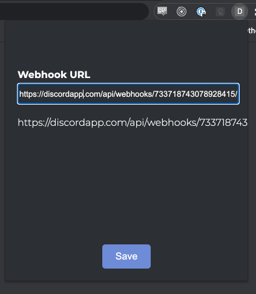
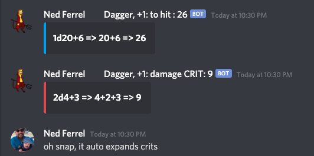

# DnDiscord

This is a basic project that can be loaded as a Google Chrome extension to be used with dndbeyond's digital dice on the character sheet.  Once loaded click the extension icon and set your webhook url.  From that point on any time you're on dndbeyond and use the dice roller it'll send the roll result to the discord webhook in a rich "embedded" format.

## Setting the webhook

## Message Example

It pulls your character's name and avatar from the page, as well as your DnDBeyond username and icon.
